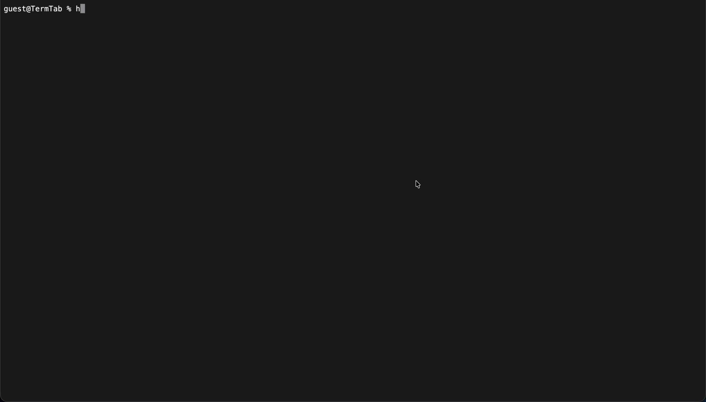

	<h1>TermTab</h1>
	<picture>
		
	</picture>
	<h3>GUIs are boring; try a terminal window instead!</h3>

## Quick Start
Explore TermTab [here!](https://brandonfglx.github.io/TermTab)

## Features
 - about: informaion about TermTab
 - clear: clears the terminal
 - echo: prints text to the terminal
 - goto: goes to a url
 - help: shows the help menu
 - info: returns info about the current session
 - loc: prints info about the user's location or about the zip code
 - search: search the World Wide Web
 - time: prints the current time
 - weather: shows the weather

## Technicals
Used Svelte as the main framework for interactivity and DOM manipulation (without the nasty JS!) and TailwindCSS for easy styles. Instead of using plain HTML elements for input, the document itself is listening for key presses, which get parsed by the [`Terminal`](./src/lib/terminal/terminal.svelte.ts) class. Commands are seperate from the terminal, and reside in its own [directory](./src/lib/terminal/commands/).

## Acknowledgements
 - Svelte Documentation - Assisted in the setup process and converting it into a static webpage using `adapter-static` and information about dynamically importing TypeScript files
 - TailwindCSS Documentation - Assisted in finding corresponding CSS tags

# License
TermTab is licensed under the [GNU General Public License Version 3](./LICENSE).